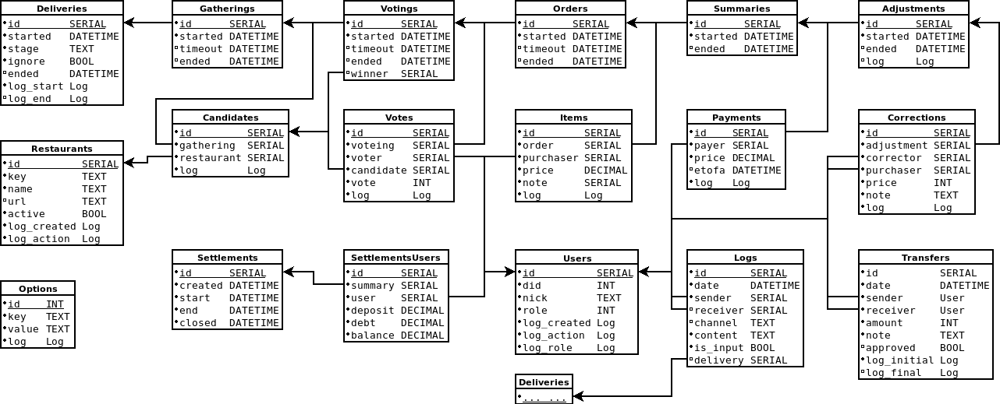

Automatic Delivery Aid: Database
================================

## Schema

## Tables

### Adjustments

### Candidates

* Plik: [`src/Database/Candidate.py`](../src/Database/Candidate.py)
* Opis: Tabela zawierająca kandydatury restauracji, które później są poddawane
        głosowaniu na restaurację z której nastąpi zamówienie.

### Corrections

### Deliveries

* Plik: [`src/Database/Delivery.py`](../src/Database/Delivery.py)
* Opis: Tabela przechowująca wszystkie rozpoczęte zamawiania, nawet jeżeli
        zakończyły się one anulowaniem. Tylko jeden proces może mieć puste pole
        `ended` i oznacza to, że jest aktualnym procesem zamawiania.
        Pole `ignore` informuje o tym, czy proces został przerwany przed
        zakończeniem, a co za tym idzie, czy powinien być on ignorowany
        w podsumowaniach.

### Gatherings

### Items

### Logs

### Options

* Plik: [`src/Database/Option.py`](../src/Database/Option.py)
* Opis: Tabela zawiera informacje o ustawieniach, każdy rekord do pojedyncza opcja.

### Orders

### Payments

### Restaurants

* Plik: [`src/Database/Restaurant.py`](../src/Database/Restaurant.py)
* Opis: Lista restauracji obsługiwanych przez system. W razie potrzeby
        (na przykład zamknięcia restauracji) można poszczególne wpisy ukrywać,
        ale nie można ich usuwać.

### Settlements

* Plik: [`src/Database/Settlement.py`](../src/Database/Settlemen.py)
* Opis: Comiesięczne podsumowania rozliczeń zawartych w bazie danych,
        pozwalające monitorować stan należności oraz przyśpieszające
        obliczania aktualnych należności.
* Uwaga: **BRAK IMPLEMENTACJI**

### SettlementsUsers

* Uwaga: **BRAK IMPLEMENTACJI**

### Summaries

### Transfers

* Plik: [`src/Database/Transfer.py`](../src/Database/Transfer.py)
* Opis: Tabela zawiera informacje o dokonanych rozliczeniach pomiędzy poszczególnymi osobami.
        Zawiera informacje: kto, komu, ile, dlaczego i kiedy przelał/przekazał.

### Users

* Plik: [`src/Database/User.py`](../src/Database/User.py)
* Opis: Tabela zawierająca wszystkich użytkowników, którzy kiedykolwiek
        zarejestrowali się w systemie, wraz z ich aktualnymi uprawnieniami.
        Jeżeli komenda, która została wydana, nie może być powiązana
        z użytkownikiem z tej tabeli, to komenda jest ignorowana. Wyjątek
        od tej reguły stanowi jedynie rejestrowanie nowego użytkownika.

### Votes

### Votings
