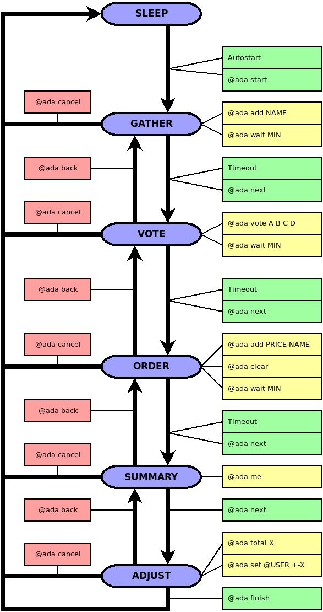

Automatic Delivery Aid: Stages
==============================

A program can be in different states during execution. 
According to the state different commands are available. 
Related states are mainly connected with the stage at which the current order is, and some of them relate
only the order itself, not the program status.

## State diagram

## List of states

| State     | Context          | Description                                                                       |
|:---------:|:----------------:|-----------------------------------------------------------------------------------|
| `SLEEP`   | program          | Nie ma żadnej bieżącej dostawy, oczekiwanie na rozpoczęcie nowej.                 |
| `INIT`    | delivery         | Tymczasowy stan oznaczający, że inicjowanie dostawy się jeszcze nie zakończyło.   |
| `GATHER`  | program/delivery | Zbieranie listy restauracji, które zostaną poddane głosowaniu.                    |
| `VOTE`    | program/delivery | Głosowanie na zebrane wcześniej restauracje.                                      |
| `ORDER`   | program/delivery | Zamawianie z restauracji, która wygrała głosowanie.                               |
| `SUMMARY` | program/delivery | Oczekiwanie na dostarczenie zamówienia, które zostało już złożone.                |
| `ADJUST`  | program/delivery | Ostateczne poprawki po przyjściu zamówienia, przed jej zakończeniem.              |
| `CANCEL`  | delivery         | Dostawa została anulowana i nie będzie ona uwzględniona w rozliczeniu.            |
| `FINISH`  | delivery         | Dostawa została poprawnie zakończona i będzie ona uwzględniona w rozliczeniu.     |

